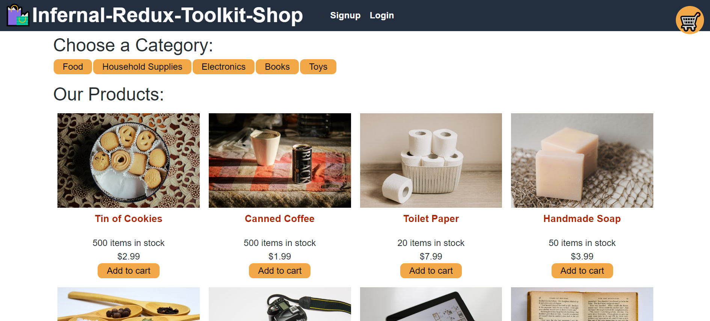

# Infernal Redux Toolkit Shop

  

  # Description
  
  A React app online shop using Redux Toolkit to handle the state and state changes throughout the app, react-redux is used specifically for useSelector and useDispatch redux functions in a react app. The app was refactored from using React's Context API to using Redux Toolkit. The app uses MongoDB for the database and mutations and queries for the database are handled by Apollo GraphQL. The online shop uses the Stripe API payment system but no actual payments are made as it is a test system. Purchases made on the app will appear in the order history of your account. JWT authentication is used when signing or logging in a user.

  # Table of Contents
  
  - [Installation](#installation)
  - [Usage](#usage)
  
  - [Deployed App](#deployed-app)
  - [Tests](#tests)
  - [Questions](#questions)

  # Installation
  
  Node.js and the following,    
  Back-end NPMs: apollo-server-express, bcrypt, express, graphql, jsonwebtoken, mongoose, stripe. For devDependencies: nodemon.  
  Front-end NPMs: @apollo/client, @reduxjs/toolkit, @stripe/stripe-js, @testing-library/jest-dom, @testing-library/react, @testing-library/user-event, graphql, jwt-decode, react, react-dom, react-redux, react-router-dom, react-scripts.  

  Database: MongoDB.

  # Usage
  
  

  # Deployed App

  The application is deployed on Heroku: [https://shrouded-headland-69573.herokuapp.com/](https://shrouded-headland-69573.herokuapp.com/)
  

  # Tests
  
  The reducer logic test was rewritten to test the reducer logic of the Redux Toolkit reducers and actions.

  To test the Stripe payment system, use 4242 4242 4242 4242 an the card number to pay with a Visa card, enter any date in the future for the expiry date, enter any CVC number and then select pay and the payment will go through.

  # Questions
  
  You can find my GitHub profile at: https://github.com/r134x7

  If you have any questions, you can contact me by email: r134x7@gmx.com

